# SharpGL

[](https://ci.appveyor.com/project/dwmkerr/sharpgl) [](https://codecov.io/gh/dwmkerr/sharpgl) [](https://dashboard.guardrails.io/gh/dwmkerr/16780)

Unlock the power of OpenGL in any .NET application. SharpGL wraps all modern OpenGL features, provides helpful wrappers for advanced objects like Vertex Buffer Arrays and shaders, as well as offering a powerful Scene Graph and utility library to help you build your projects.


Check out the [Samples](https://github.com/dwmkerr/sharpgl/wiki/Samples), they're a great place to start learning how to use SharpGL.


<!-- vim-markdown-toc GFM -->

* [Getting Started](#getting-started)
* [Developer Guide](#developer-guide)
    * [Releasing](#releasing)
* [Sample Applications](#sample-applications)
    * [Ducky Sample](#ducky-sample)
* [Documentation](#documentation)
* [Credits, Sponsorship & Thanks](#credits-sponsorship--thanks)
* [Built with SharpGL](#built-with-sharpgl)

<!-- vim-markdown-toc -->

## Getting Started

Install SharpGL packages with NuGet, either by using the Package Explorer or the Package Manager tool, e.g:

```
PM> Install-Package SharpGL
```

The available packages are:

| Package              | Link                                                                                                                              | Usage                                                                                             |
|----------------------|-----------------------------------------------------------------------------------------------------------------------------------|---------------------------------------------------------------------------------------------------|
| `SharpGL`            | [](https://www.nuget.org/packages/SharpGL)                             | The Core is simply the full set of OpenGL functions and extensions wrapped and available to use.  |
| `SharpGL.SceneGraph` | [](https://www.nuget.org/packages/SharpGL.SceneGraph) | The SceneGraph library contains a full class library which models key OpenGL entities.            |
| `SharpGL.WPF`        | [](https://www.nuget.org/packages/SharpGL.WPF)                      | SharpGL for WPF includes the Core as well as OpenGL controls to drop into your WPF app.           |
| `SharpGL.WinForms`   | [](https://www.nuget.org/packages/SharpGL.WinForms)       | SharpGL for WinForms includes the Core as well as OpenGL controls to drop into your WinForms app. |

There are project templates available for SharpGL WinForms and WPF projects - just search for SharpGL on the Visual Studio Extensions gallery, or get the extensions directly:

* [SharpGL for Visual Studio 2010](http://visualstudiogallery.msdn.microsoft.com/ba57efa3-4061-4cdf-97f5-51715c4f120a)
* [SharpGL for Visual Studio 2012/2013](http://visualstudiogallery.msdn.microsoft.com/b61cc443-4790-42b7-b7ab-2691119667d2)

## Developer Guide

To build the code, clone the repo and open the SharpGL, Samples or Tools solution. The Extensions solution is used for the Visual Studio Project Templates and requires additional components - you can find out more on the Wiki on the '[Developing SharpGL](https://github.com/dwmkerr/sharpgl/wiki/Developing-SharpGL)' page.

You can also use the following scripts to run the processes:

| Script         | Notes                                                                                                                   |
|----------------|-------------------------------------------------------------------------------------------------------------------------|
| `config.ps1`   | Ensure your machine can run builds by installing necessary components such as `nunit`. Should only need to be run once. |
| `build.ps1`    | Build all solutions. Ensures that we build both 32/64 bit versions of native components.                                |
| `test.ps1`     | Run all tests, including those in samples.                                                                              |
| `coverage.ps1` | Create a coverage report. Reports are written to `./artifacts/coverage`                                                 |

These scripts will generate various artifacts which may be useful to review:

```
artifacts\
  \tests                  # NUnit Test Reports
  \coverage               # Coverage Reports
```

### Releasing

To make and publish a release:

1. Update the `SharedAssemblyInfo.cs` file with the version
2. Create the version tag (e.g. `git tag v3.2.1`)
3. Push the code and tags (e.g. `git push --follow-tags`)

AppVeyor will automatically push the release to NuGet and GitHub.

## Sample Applications

There are a large number of sample applications that show how to use SharpGL. Check out the 'Samples' solution to see the samples that are available.

### WinForms - Ducky Sample

This sample shows how to load an object file with materials, using the Serialization library. It also has great support for internationalization (thanks [`odalet`](https://github.com/odalet))!

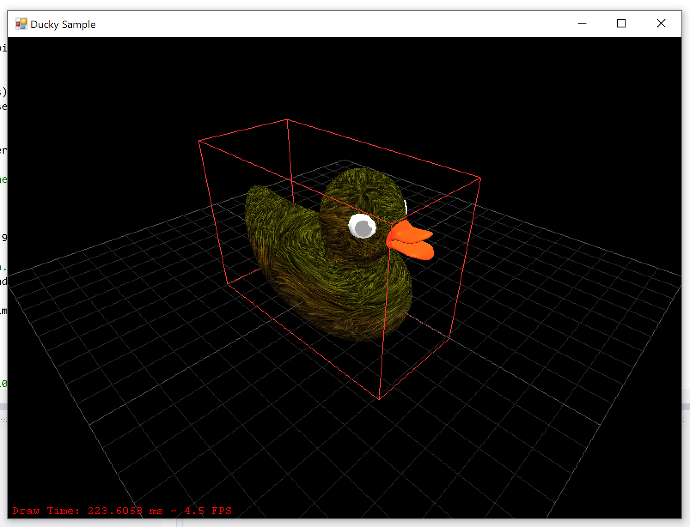

This sample demonstrates:

- Loading `*.obj` files and associated materials
- Building polygons from `*.obj` files
- Arcball rotation

Note that this sample uses _immediate mode_ OpenGL, which is officially deprecated.

### WinForms - Extensions Sample

This sample shows how to use OpenGL extensions. It demonstrates this by using the 'bump map' extensions.

Note that this sample uses _immediate mode_ OpenGL, which is officially deprecated.

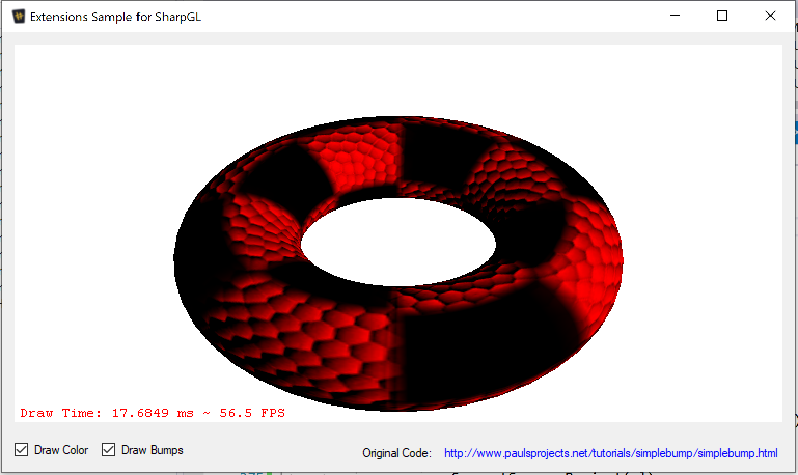

### WinForms - Hit Test Sample

This sample shows how to use to perform hit testing with SharpGL. It uses the _Scene Graph_ to support this.

Note that this sample uses _immediate mode_ OpenGL, which is officially deprecated.


### WinForms - Modern OpenGL Sample

This sample shows how to use modern OpenGL capabilities which are Shader based, by showing a vertex and fragment shader.

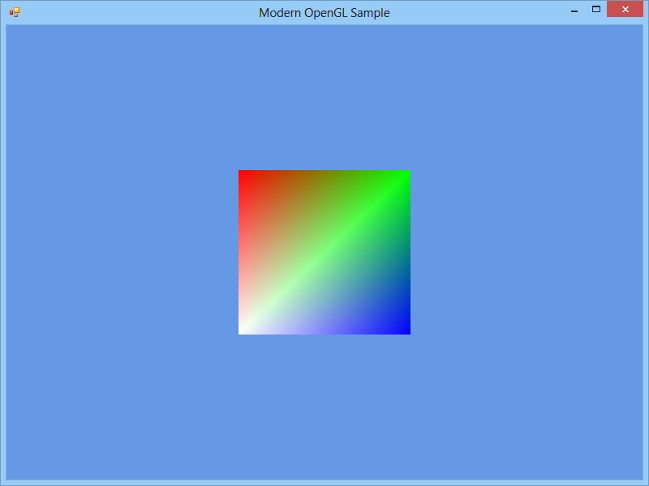

### WinForms - Native Textures Sample

This sample shows how to load textures into OpenGL using pure OpenGL functions. However, the `Texture` object from the `SceneGraph` will be much easier to use!

Note that this sample uses _immediate mode_ OpenGL, which is officially deprecated.

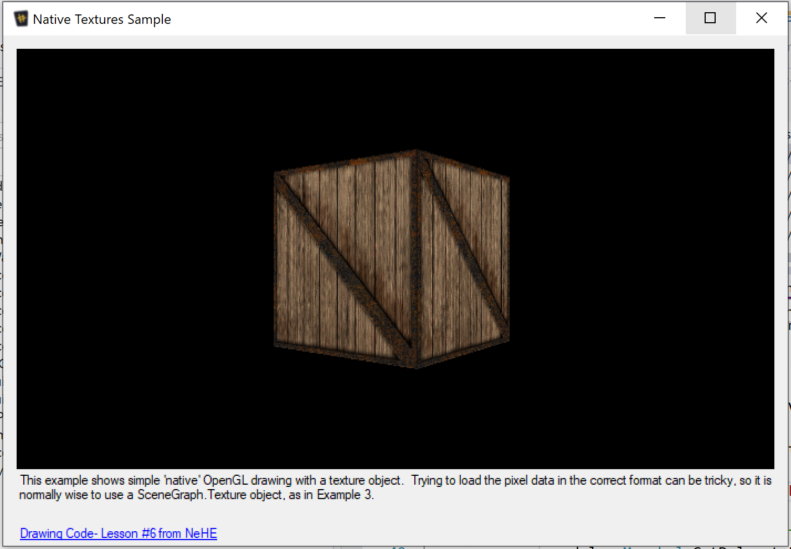

### WinForms - Particle Systems Sample

This sample shows how to build a simple particle system with OpenGL.

Note that this sample uses _immediate mode_ OpenGL, which is officially deprecated.

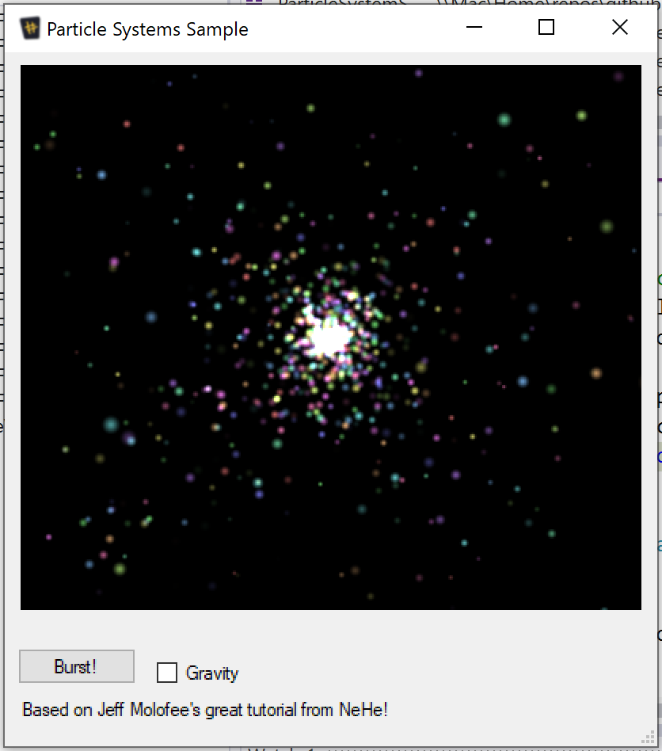

### WinForms - Polygon Loading

This sample shows how to load polygon data with the Scene Graph and Serialization libraries.

Note that this sample uses _immediate mode_ OpenGL, which is officially deprecated.

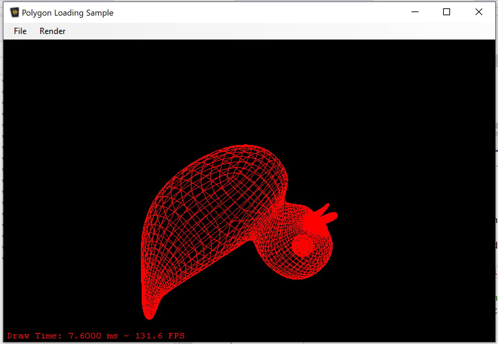

### WinForms - Radial Blue

This sample shows how to use a Radial Blur effect in OpenGL.

Note that this sample uses _immediate mode_ OpenGL, which is officially deprecated.

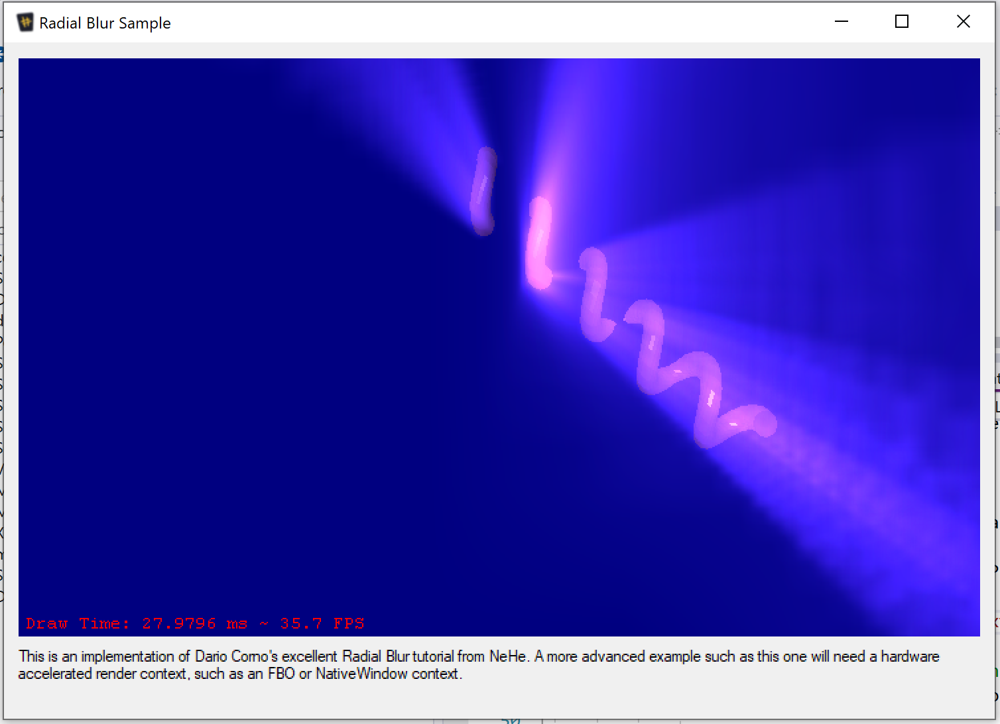

### WinForms - Render Contexts Sample

This sample demonstrates the different types of render contexts which are available, and how they affect performance and the extensions available.

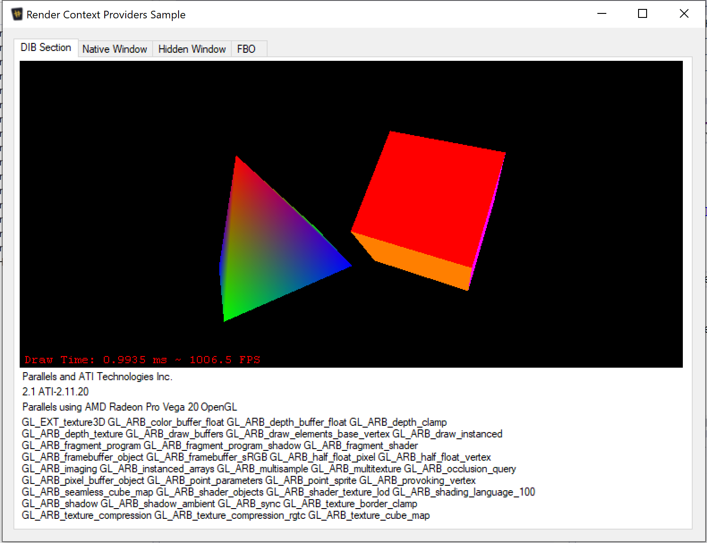

### WinForms - Render Trigger Sample

This sample shows different ways to render; either on a timer or on demand.

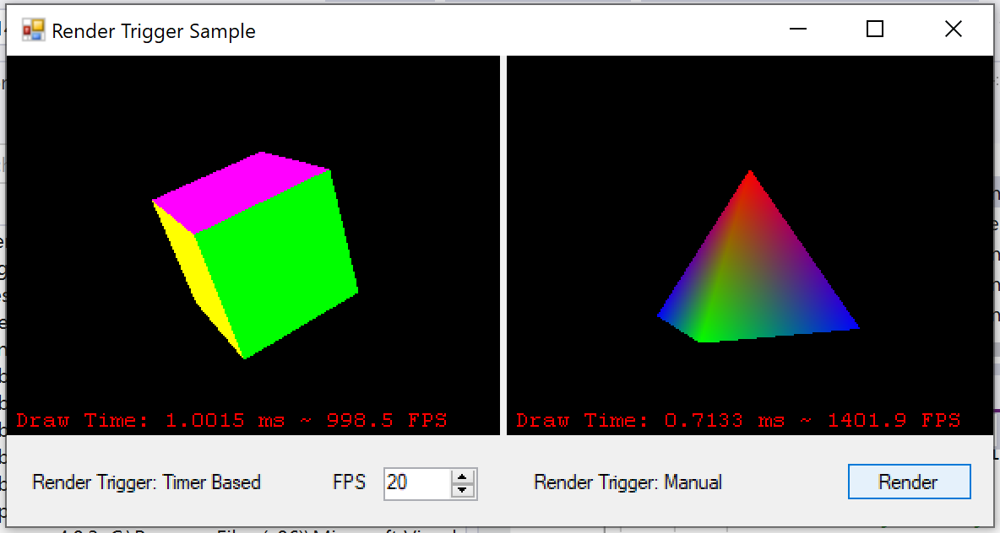

### WinForms - Scene Sample

This sample demonstrates the _Scene Graph_ which can be used to manage and render geometry.

Note that this sample uses _immediate mode_ OpenGL, which is officially deprecated.

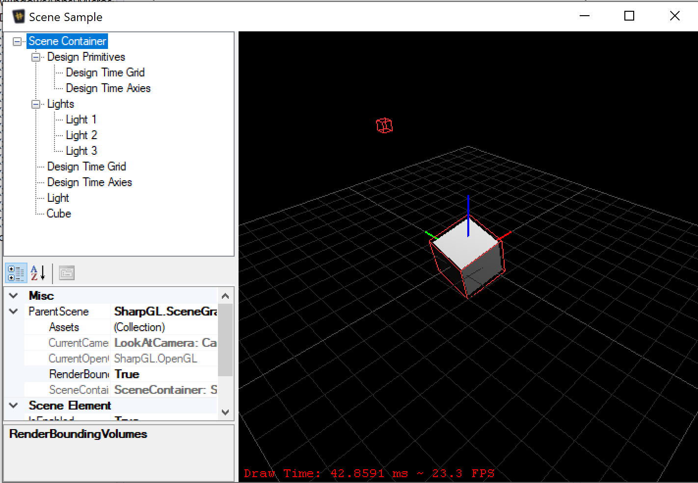

### WinForms - SharpGL Textures Sample

This sample demonstrates how textures can be loaded using the SharpGL `Textures` object, which greatly simplifies texture management.

Note that this sample uses _immediate mode_ OpenGL, which is officially deprecated.

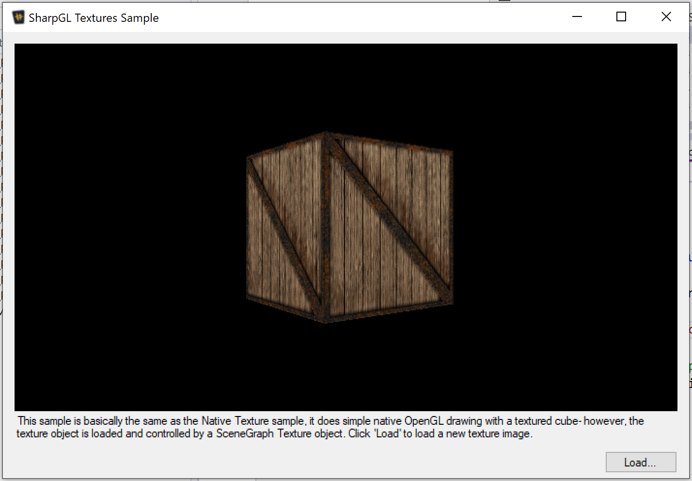

### WinForms - Simple Drawing Sample

This sample demonstrates the most basic form of simple drawing in OpenGL.

Note that this sample uses _immediate mode_ OpenGL, which is officially deprecated.

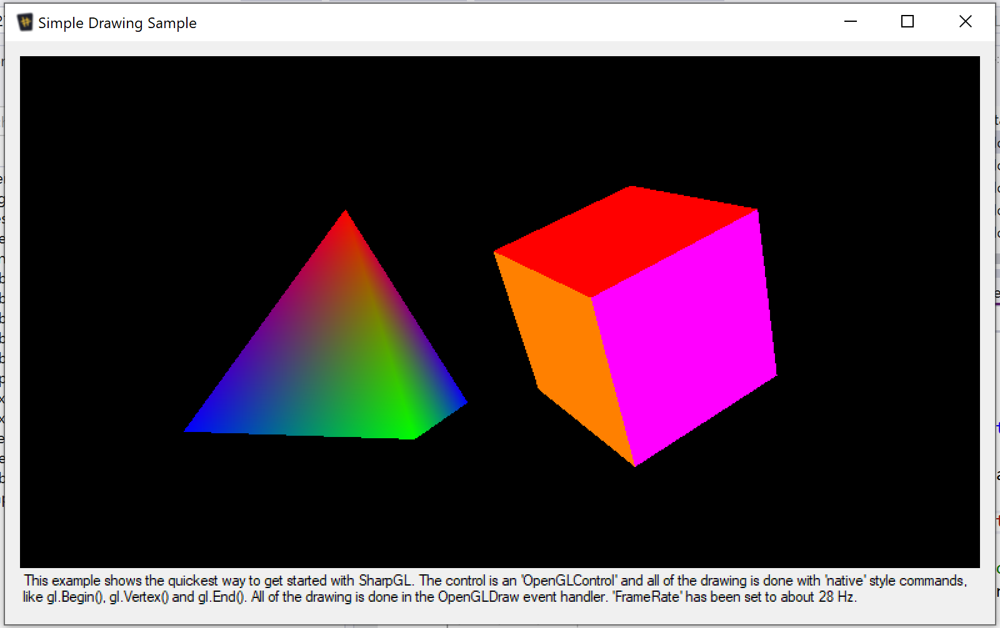

### WPF - Cel Shading Sample

This sample demonstrates how to use shaders to crete a cel-shaing effect.

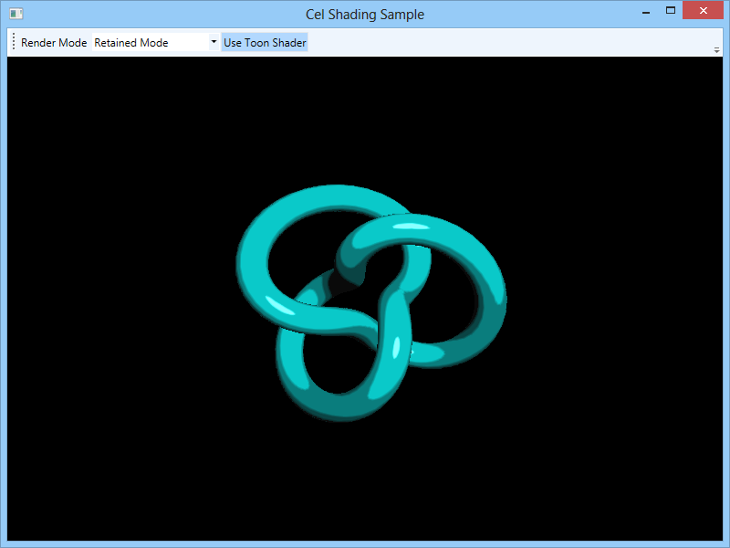

### WPF - Drawing Mechanisms Sample

This sample demonstrates how to use shaders to crete a cel-shaing effect.

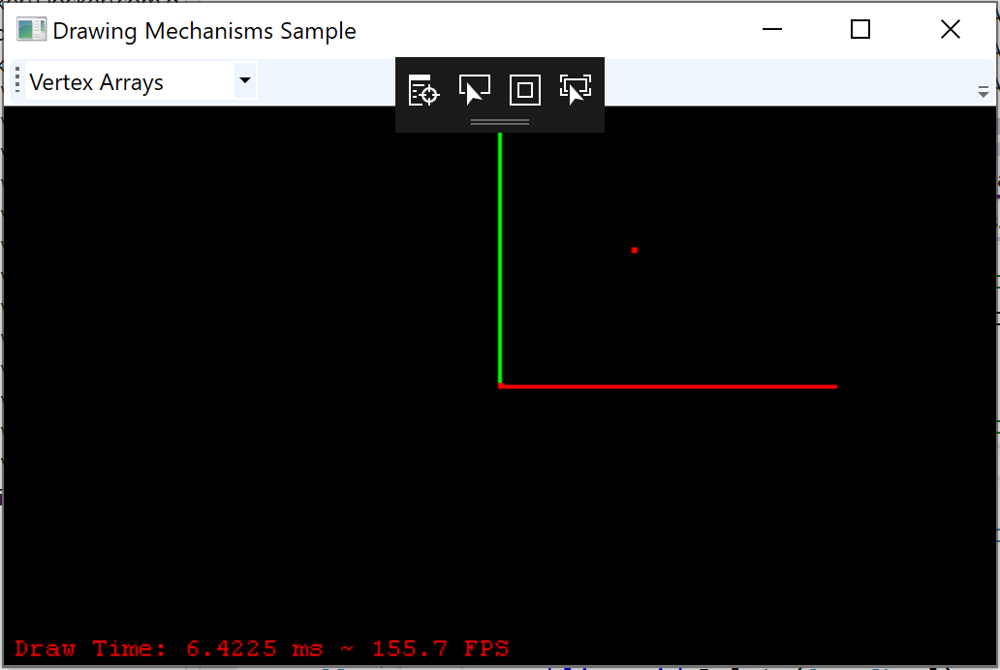

### WPF - Object Loading Sample

This sample demonstrates how to load objects in a WPF OpenGL project.

### WPF - Simple Shader Sample

This sample shows how to use a simple shader.

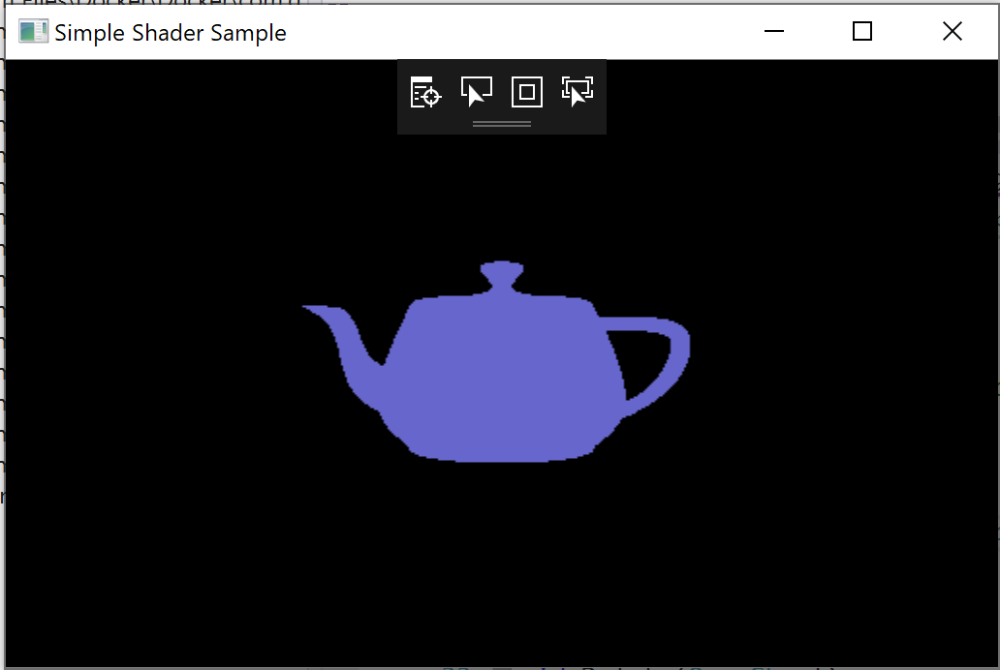

### WPF - Tea Pot Sample

This sample shows how to quickly and easily render geometry.


### WPF - Text Rendering Sample

This sample shows how to render 3D and 2D text.


### WPF - Two Dimensional Rendering Sample

This sample shows how to do simple 2D render, with a visual like an old Windows Screen-Saver.


## Documentation

All documentation is available on [the Wiki](https://github.com/dwmkerr/sharpgl/wiki).

## Credits, Sponsorship & Thanks

SharpGL is written and maintained by me. Special thanks go to the following contributors:

 * [`robinsedlaczek`](https://github.com/robinsedlaczek) - Code and documentation updates, tireless patience 
   while I get through a backlog of work!
 * [`odalet`](https://github.com/odalet) - amazing work on internationalization and making the serialization code work in all locales

**NDepend**


SharpGL is proudly sponsored by NDepend! Find out more at [www.NDepend.com](http://www.NDepend.com).

**Red Gate**


Many thanks to [Red Gate](http://www.red-gate.com/) who have kindly provided SharpGL with a copy of their superb [.NET Developer Bundle](http://www.red-gate.com/products/dotnet-development/dotnet-developer-bundle/)

**JetBrains**

[](https://www.jetbrains.com/?from=sharpgl)

Thanks for [JetBrains](https://www.jetbrains.com/?from=sharpgl) for sponsoring SharpGL with [Resharper](http://www.jetbrains.com/resharper/)!

## Built with SharpGL

If you've got a project that uses SharpGL and you'd like to show it off, just add the details here in a PR!

**[Open Vogel](https://sites.google.com/site/gahvogel/)**

Checkout https://sites.google.com/site/gahvogel/ to see a free, open source project which supports aerodynamics!

**[AgOpenGPS](https://github.com/farmerbriantee/AgOpenGPS)**

This is the *very first* open source Precision Agricultural App! Built by [Brian Tischler](https://github.com/farmerbriantee), you can see [the discussions and excitement on this project with farmers across the world](http://www.thecombineforum.com/forums/31-technology/278810-agopengps.html)!
